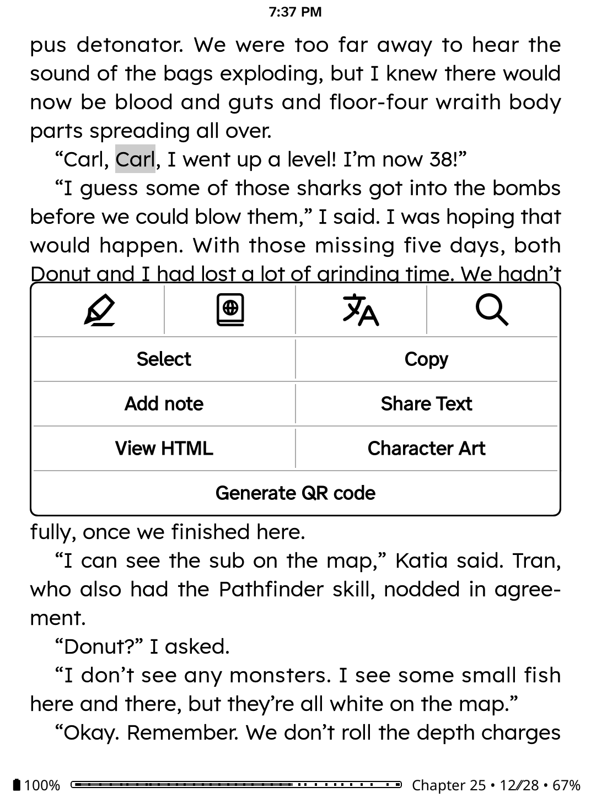
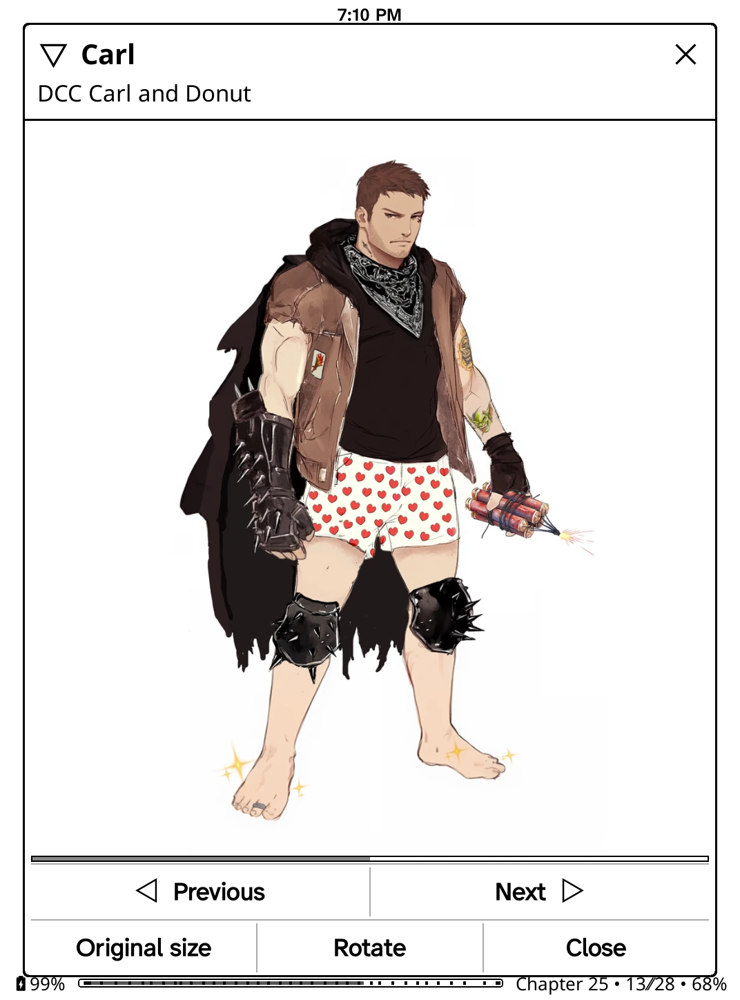

# Character Art

A KOReader plugin. Highlight a character's name while reading and see art of
them without leaving the book.

Reading *Dungeon Crawler Carl* and can't picture Princess Donut? Highlight her
name, tap **Character Art**, and you get fan art from the book's wiki, with the
artist credited.

It works the same way the dictionary does. Highlight, tap, read, carry on.

| Highlight a name | See who they are |
|---|---|
|  |  |

Two or three pictures are gathered per character. **Previous** and **Next** step
through them, **Set as default** keeps the one you like so it comes up first
next time, and **Source** opens the wiki page the picture came from.

The line under the name is the credit, taken from what the uploader wrote on the
wiki -- which is usually a good deal more informative than the filename.

## No AI-generated images. Ever.

Every picture this plugin shows was drawn by a person and uploaded to a wiki by
the fans who maintain it.

- It does **not** generate images.
- It does **not** call image models, LLMs, or any AI service.
- It does **not** use AI image search or "AI-enhanced" results.
- It holds **no API keys** and talks to **no AI provider**, because there is
  nothing in it that would need one.

The only servers it contacts are the wiki you are reading about and that wiki's
image host. That is the whole network surface.

This is deliberate. The art belongs to the people who drew it, and a plugin
built to show you fan art has no business laundering it through a model. The
credit shown under each picture is whatever the uploader wrote on the wiki --
"Art by @hunnydohandmade, Instagram" -- falling back to the filename when they
wrote nothing.

If you maintain a wiki and want your art out of this, removing or renaming it on
the wiki removes it here too. There is no separate copy to chase, beyond a local
cache on the reader's own device.

## How it finds the right pictures

Highlighting is messy. People highlight `Carl`, but they also highlight
`Princess Donut the Queen Anne Chonk`, or a whole sentence, or a name they
half-remember. Searching a wiki's images for any of those directly returns junk.

So the lookup runs in two phases:

1. **Resolve.** Ask the wiki which *article* the highlighted text refers to.
   Article search copes well with long or misremembered names --
   `Donut the Princess of Anna Chonk` still lands on `Donut`.
2. **Gather.** Using that article's real title, look for pictures: the
   subject's gallery or fan art page first, then images whose filename names
   the subject, then the pictures on the article itself.

Searching for art only ever uses the tidy resolved name, never the raw
highlight, which is what keeps the results clean.

## Which wiki?

The plugin works out which wiki covers the book from its metadata, in order:

1. A wiki you have already chosen for this book.
2. The bundled list in [`data/wikis.lua`](data/wikis.lua).
3. A guess at the Fandom address, derived from the series name.
4. Asking you, once, and remembering the answer.

It speaks plain MediaWiki, so it is not limited to Fandom. Independent wikis
like `wiki.lspace.org` and `awoiaf.westeros.org` work just as well -- paste the
address and it will use it.

## Getting to it

Highlight a name and tap **Character Art** in the popup.

Pressing a *single* word opens KOReader's dictionary rather than the highlight
menu, and that is the gesture most people use on a name. So **Character Art is
in the dictionary popup too** -- tap it there and it looks up the word the
dictionary is showing. Nothing of KOReader's own is replaced to do this; both
the highlight menu and the dictionary popup have a documented way for plugins
to add a button.

There is also a bindable action called **Character Art**, for a gesture or a
hardware key under *Taps and gestures*. It looks up whatever is selected, or
asks for a name if nothing is.

**On ZenOS**, both popups are replaced with its own icon rows, and third-party
buttons are hidden by default. Turn on *Highlight / Lookup → Show other items*
in ZenOS settings and Character Art appears in both.

## Looking someone up twice

Characters get forgotten and looked up again two hundred pages later. Results
and the pictures themselves are cached, so the second lookup is instant and
works with the wifi off.

If the first picture is not the likeness you had in mind, page to one that is
and press **Set as default**. That choice is kept against the character and the
wiki rather than the book, so a Carl chosen in book one still comes up first in
book seven.

## Installing

Copy this directory into KOReader's `plugins` directory, named
`charart.koplugin`, and restart KOReader.

```
git clone https://github.com/afzafri/charart.koplugin.git
```

## Contributing

The two most useful contributions need no Lua at all:

- **Add a wiki** to [`data/wikis.lua`](data/wikis.lua) for a book that isn't
  found automatically.
- **Add a gallery page pattern** to
  [`data/gallery_patterns.lua`](data/gallery_patterns.lua) if your wiki
  collects art on a page shaped differently from the ones already listed.

To add a whole new place to look for pictures, drop a file in `sources/`. It is
picked up automatically -- there is no list to add yourself to.

Sources that generate images, or that query an AI service, will not be merged.

## License

MIT
