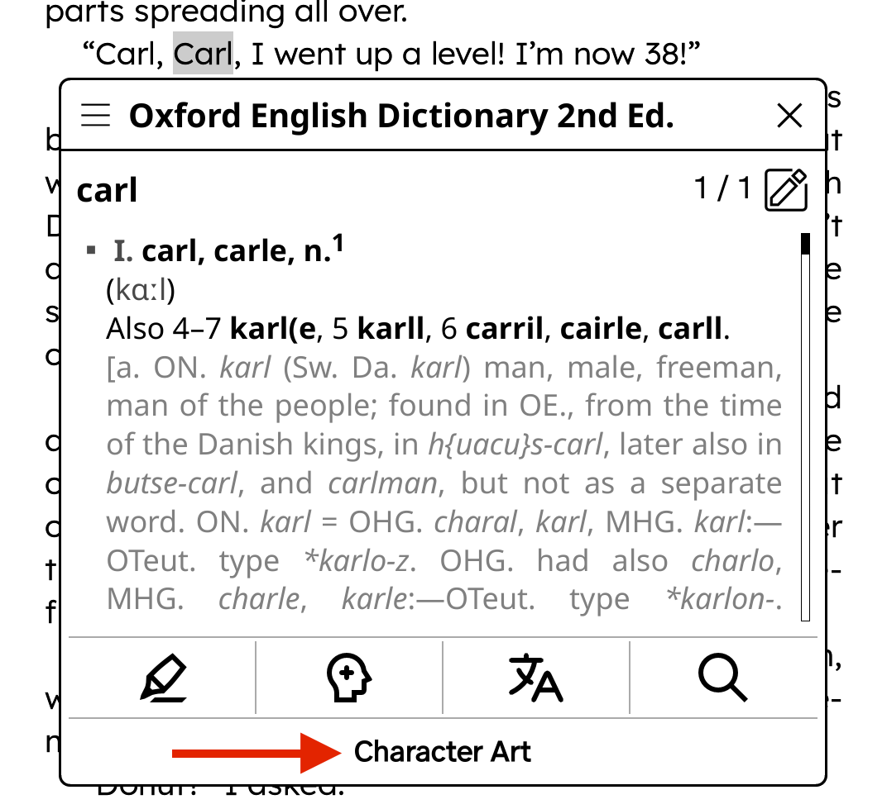
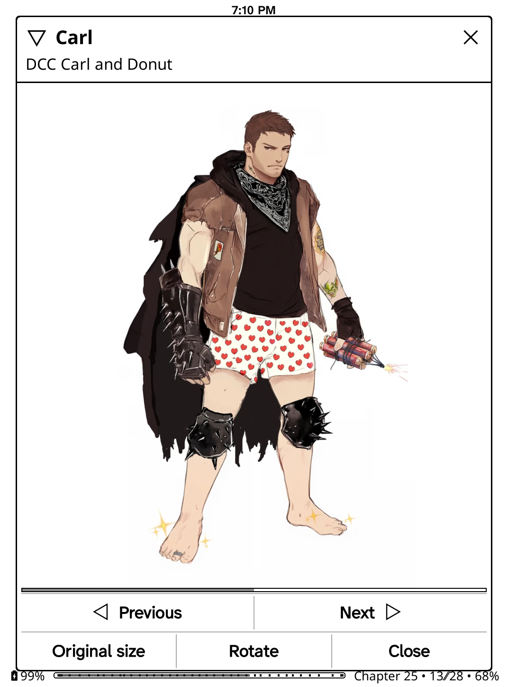
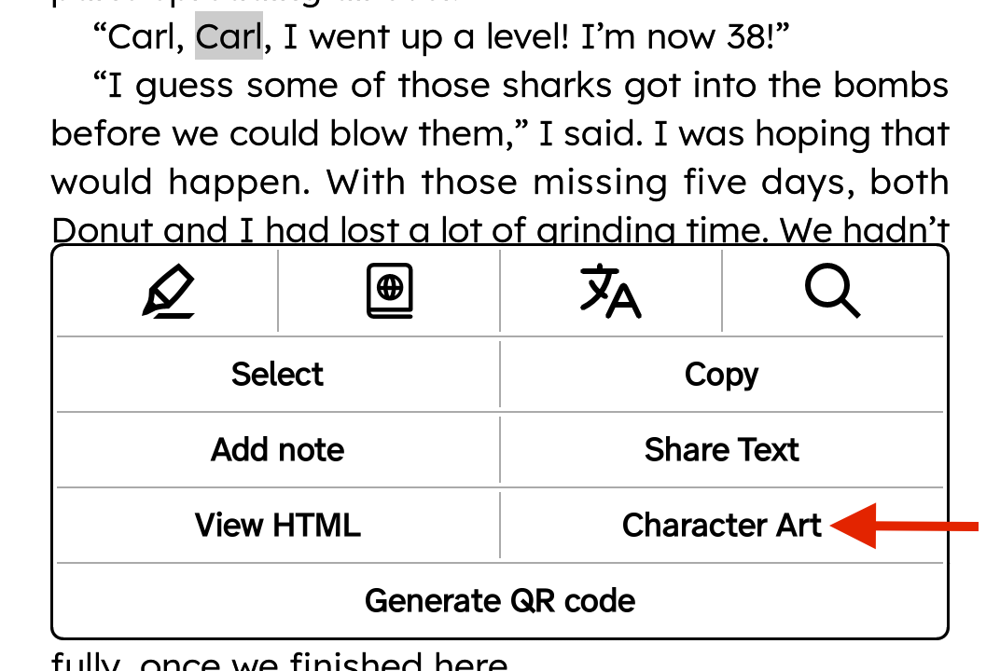

# Character Art


**See what the characters in your book look like.** Hold a character's name while
reading and Character Art shows you art of them from the book's wiki, without
leaving the page.

| Hold a name | See who they are |
|---|---|
|  |  |

Holding a name opens the dictionary, which will tell you that *carl* is Old
Norse for "man, freeman" — true, and no help when Carl is a bloke in his
underwear fighting a dungeon.

## Installation

> [!IMPORTANT]
> Install from the **latest release**, not from *Code → Download ZIP*. The
> download button gives you the repository, which will not run as a plugin.

1. Go to the [latest release](https://github.com/afzafri/charart.koplugin/releases/latest).
2. Under **Assets**, download `charart.koplugin.zip`.
3. Unzip it. You should have a folder named exactly `charart.koplugin`, with
   `main.lua` inside it.
4. Connect your reader by USB and copy that folder into KOReader's `plugins`
   folder:

   | Device | Where to put it |
   |---|---|
   | Kobo | `.adds/koreader/plugins/` |
   | Kindle | `koreader/plugins/` |
   | Android | `koreader/plugins/` |
   | PocketBook | `applications/koreader/plugins/` |
   | Linux | `~/.config/koreader/plugins/` |
   | macOS | `~/Library/Application Support/koreader/plugins/` |

   You should end up with `…/plugins/charart.koplugin/main.lua`.

5. Eject the reader and **restart KOReader** (a full restart, not just closing
   the book).
6. Open a book, hold a character's name, and tap **Character Art**.

> [!TIP]
> The folder must be named `charart.koplugin`. If unzipping gave you something
> like `charart.koplugin-1.0.0` or a folder containing another folder, rename or
> flatten it, or KOReader will not see the plugin.

> [!TIP]
> Using **ZenOS**? It replaces KOReader's popups with its own and hides
> third-party buttons by default. Turn on *Highlight / Lookup → Show other
> items* in ZenOS settings and Character Art will appear.

## Using it

**Hold a character's name.** The dictionary opens, and **Character Art** is one
of its buttons. Tap it.

There are two other ways in, if you prefer:

- **Hold for three seconds**, or select more than one word, to get KOReader's
  highlight menu, where Character Art sits with Copy and Add note:

  

- **Assign a gesture.** Under *Taps and gestures* there is a **Character Art**
  action. It looks up whatever you have selected, or asks for a name.

Once the pictures are open:

| Button | What it does |
|---|---|
| **Previous** / **Next** | Page through the pictures found |
| **Set as default** | Keep this one, so it comes up first next time |
| **Source** | Open the wiki page the picture came from |

The line under the name credits the artist, taken from what the uploader wrote
on the wiki.

## The first time you open a new book

Character Art needs to know which wiki covers the book. Usually it works this
out on its own, from the book's title, series, author and filename.

If it cannot, it searches and shows you what it found:

```
Which wiki covers this book?
Tap one to use it, or hold to open it in a browser first.

  A Wheel of Time Wiki      ·  6563 articles
  The Wheel of Time Wiki    ·   760 articles
  Enter a link or name instead…
```

Hold any of them to open it in your browser and check before choosing. Your
choice is remembered for that book, and you can change it later under
*Tools → Character Art → Wiki*.

Nothing to find? Choose **Enter a link or name instead…** and paste the wiki's
address, or just its Fandom name like `dungeon-crawler-carl`. It is checked
before being saved, so a typo tells you straight away.

## Good to know

- **Looking someone up twice is instant.** Results and pictures are kept on the
  device, so the second time works even with the wifi off.
- **It needs a connection the first time.** If there is no network it says so,
  rather than pretending the character does not exist.
- **Any MediaWiki site works**, not only Fandom. Independent wikis like
  `wiki.lspace.org` are fine — paste the address.

## Updating

Character Art works with
[Updates Manager](https://github.com/advokatb/updatesmanager.koplugin), so
updates arrive on the device. Add it as a plugin repository:

```lua
{
    owner = "afzafri",
    repo = "charart.koplugin",
    description = "Character Art plugin",
}
```

What changed in each version is in [CHANGELOG.md](CHANGELOG.md).

## No AI in this plugin

Nothing here generates a picture, and nothing here asks a model for one.

- It does **not** generate images.
- It does **not** call image models, LLMs, or any AI service.
- It does **not** use AI image search or "AI-enhanced" results.
- It holds **no API keys** and talks to **no AI provider**, because there is
  nothing in it that would need one.

The only servers it contacts are the wiki covering the book you are reading and
that wiki's image host. That is the whole network surface.

This is deliberate. The art belongs to the people who drew it, and a plugin
built to show you fan art has no business laundering it through a model.

### What it cannot promise

This plugin fetches what a wiki hosts and shows it to you. It does not inspect,
judge or filter that content, and it has no way to tell how a picture was made.

So: if the people who maintain a wiki upload AI-generated art, this plugin will
display it, the same as everything else there. Whether that is acceptable is a
decision for each wiki's community, made on the wiki — not something a reading
plugin can or should police from the outside. Fix or remove a picture on the
wiki and it changes here, because there is no separate copy beyond a cache on
your own device.

## How it finds the right pictures

Highlighting is messy. People hold `Carl`, but also `Princess Donut the Queen
Anne Chonk`, or a whole sentence, or a name they half-remember. Searching a
wiki's images for any of those directly returns junk.

So the lookup runs in two phases:

1. **Resolve.** Ask the wiki which *article* the highlighted text refers to.
   Article search copes with long or misremembered names — `Donut the Princess
   of Anna Chonk` still lands on `Donut`.
2. **Gather.** Using that article's real title, look for pictures: the
   subject's gallery or fan art page first, then images whose filename names the
   subject, then the pictures on the article itself.

Searching for art only ever uses the tidy resolved name, never the raw
highlight, which is what keeps the results clean.

## Tested on

Developed and checked on a real device, not an emulator:

| | |
|---|---|
| Reader | Onyx BOOX Go 6 (`Go6_2`), 6" e-ink, 1072x1448 at 300dpi |
| System | Android 11 (SDK 30), arm64-v8a |
| KOReader | v2026.07.1 |
| Distribution | ZenOS 3.2.2 |

Nothing in the plugin is specific to that hardware — it uses KOReader's own
APIs throughout — so it should work anywhere KOReader runs. Kobo, Kindle and
desktop are simply untested, and reports either way are welcome.

## Contributing

The two most useful contributions need no Lua at all:

- **Add a wiki** to [`data/wikis.lua`](data/wikis.lua) for a book that isn't
  found automatically.
- **Add a gallery page pattern** to
  [`data/gallery_patterns.lua`](data/gallery_patterns.lua) if your wiki collects
  art on a page shaped differently from the ones already listed.

To add a whole new place to look for pictures, drop a file in `sources/`. It is
picked up automatically — there is no list to add yourself to. See
[CONTRIBUTING.md](CONTRIBUTING.md).

Sources that generate images, or that query an AI service, will not be merged.

## License

MIT
